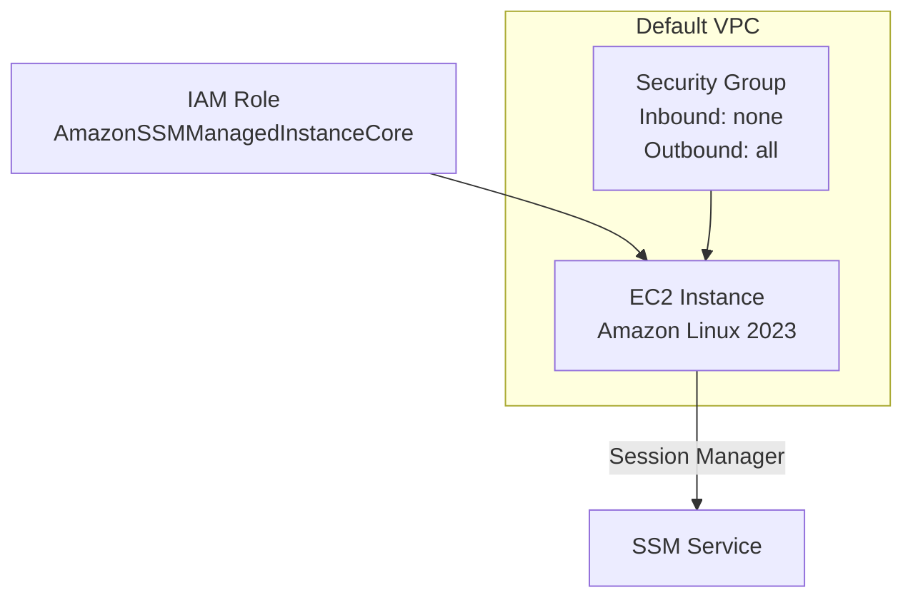

# AWS Portfolio - EC2 with SSM

このリポジトリは、Terraform を用いて **Amazon EC2 + IAM ロール + Session Manager** を構築するサンプルです。  
SSHキーを使わず、**AWS Systems Manager (SSM) Session Manager** で安全にEC2へアクセスできます。

---

## アーキテクチャ図



---

## 構築リソース

* EC2 インスタンス (Amazon Linux 2023, t3.micro)
* IAM Role + Instance Profile (`AmazonSSMManagedInstanceCore` ポリシー付与)
* Security Group (インバウンド無し、アウトバウンド全許可)
* Session Manager プラグイン経由でのログイン

---

## 利用手順

### 1. 初期化

```bash
terraform init
```

### 2. 差分確認

```bash
terraform plan
```

### 3. デプロイ

```bash
terraform apply
# yes を入力
```

### 4. 出力確認

```bash
terraform output
```

以下のように表示されます：

```
instance_id = "i-xxxxxxxxxxxx"
public_ip   = "xx.xx.xx.xx"
ssm_command = "aws ssm start-session --target i-xxxxxxxxxxxx --profile study-admin --region ap-northeast-1"
```

### 5. SSMで接続

```bash
aws ssm start-session --target <instance_id> --profile study-admin --region ap-northeast-1
```

---

## 事前準備

* AWS CLI v2 インストール済み
* Session Manager Plugin インストール済み
* AWS プロファイル `study-admin` が設定済み

---

## 破棄

学習後は不要リソースを削除してください。

```bash
terraform destroy
```

